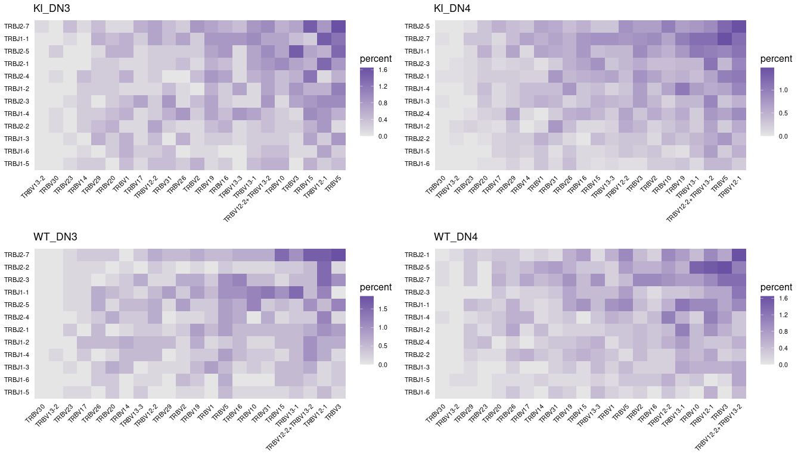

# **djvdj** 

<!-- badges: start -->

[](https://github.com/rnabioco/djvdj/actions)
[](https://codecov.io/gh/rnabioco/djvdj)
<!-- badges: end -->

The djvdj package provides a range of tools to analyze and manipulate
single cell V(D)J sequencing data. These tools are straightforward and
easily integrate into a standard [Seurat](https://satijalab.org/seurat/)
workflow.

### **Installation**

You can install the development version of djvdj from
[github](https://github.com/rnabioco/djvdj) with:

``` r
# install.packages("devtools")
devtools::install_github("rnabioco/djvdj")
```

### **Import**

With djvdj you can import V(D)J sequencing results from [Cell
Ranger](https://support.10xgenomics.com/single-cell-vdj/software/pipelines/latest/using/vdj#header)
and add these data to your current
[Seurat](https://satijalab.org/seurat/) object using `import_vdj()`.
Additional functions are provided to filter (`filter_vdj()`) and
manipulate (`mutate_vdj()`) the Seurat object based on a range of V(D)J
metrics including chains, clonotypes, and CDR3 sequences.

``` r
# Import VDJ data
paths <- c(
  KI_DN3_GE = "data/tcr/KI_DN3_TCR",
  KI_DN4_GE = "data/tcr/KI_DN4_TCR",
  WT_DN3_GE = "data/tcr/WT_DN3_TCR",
  WT_DN4_GE = "data/tcr/WT_DN4_TCR"
)

so_tcr <- import_vdj(
  sobj_in = so_tcr,                           # Seurat object
  vdj_dir = paths                             # Cellranger output directories
)

# Filter for paired chains
so_filt <- filter_vdj(
  sobj_in = so_tcr,                           # Seurat object
  filt    = all(c("TRA", "TRB") %in% chains)  # Condition for filtering
)
```

### **Calculate**

djvdj allows you to calculate a range of population diversity and
similarity metrics implemented with the
[abdiv](https://github.com/kylebittinger/abdiv) package. The function
`calc_diversity()` can be used to measure diversity on a per-cluster or
per-sample basis to allow for comparison across conditions.
`calc_similarity()` will measure repertoire overlap between clusters or
samples to allow for direct comparisons between cells of interest.
Additional functions are also available to calculate clonotype
abundances (`calc_abundance()`) and relative gene usage
(`calc_usage()`).

``` r
# Calculate five different diversity metrics for each sample
fns <- list(
  "simpson"     = abdiv::simpson,
  "shannon"     = abdiv::shannon,
  "margalef"    = abdiv::margalef,
  "menhinick"   = abdiv::menhinick,
  "brillouin_d" = abdiv::brillouin_d
)

so_tcr <- calc_diversity(
  sobj_in       = so_tcr,        # Seurat object
  clonotype_col = "cdr3",        # meta.data column containing clonotype ids
  cluster_col   = "orig.ident",  # meta.data column containing cell labels
  method        = fns            # abdiv method to use
)
```

### **Plot**

For each ‘calc’ function, djvdj also provides a corresponding ‘plot’
function to summarize the results.

``` r
# Compare the usage of different V and J genes
ggs <- plot_usage(
  sobj_in     = so_tcr,                 # Seurat object
  gene_cols   = c("v_gene", "j_gene"),  # meta.data column(s) containing genes
  cluster_col = "orig.ident",           # meta.data column containing cell labels
  chain       = "TRB",                  # Chain to use for filtering genes
  chain_col   = "chains",               # meta.data column containing chains identified
  plot_colors = c("grey90", "#6A51A3")  # Colors to use for heatmap
) %>%
  imap(~ .x + ggtitle(.y))

plot_grid(plotlist = ggs)
```

<!-- -->
